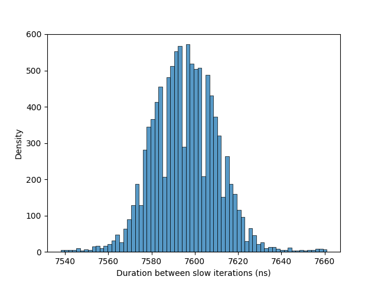

# Labo prerformance

## Informations du cache

### Questions :

1. **Combien de niveaux de cache avez-vous sur votre ordinateur ?**
   Un ordinateur dispose de 3 niveaux de cache : L1, L2 et L3.

2. **Quelle est la taille d'une ligne de cache en bytes ?**
   La taille d'une ligne de cache est de 64 bytes.

3. **Quels sont les tailles des caches pour chaque niveau en KiB ?**
    - L1 : - LEVEL1_ICACHE_SIZE = 32768 → 32 KB     (Instruction cache)
           - LEVEL1_DCACHE_SIZE = 49152 → 48 KB     (Data cache)
  
    - L2 : - LEVEL2_CACHE_SIZE = 1310720 → ~1.25 MB
    - L3 : - LEVEL3_CACHE_SIZE = 12582912 → 12 MB 

## Expérience n°1 : Prédiction d'embranchements

### Questions :

En rapport avec branch-mispredictor.cpp

1. **Quelle est la différence entre les deux exécutions ?**
   La différence entre les deux exécutions est que la première exécution (avec l'argument 0) traite un tableau non trié, tandis que la seconde exécution (avec l'argument 1) traite un tableau trié.

2. **Pouvez-vous expliquer pourquoi ?**
   La différence de performance entre les deux exécutions s'explique par la prédiction d'embranchements. Dans le cas du tableau trié, les embranchements sont plus prédictibles, ce qui permet au processeur de mieux anticiper les instructions à exécuter, réduisant ainsi les pénalités de misprediction. En revanche, dans le cas du tableau non trié, les embranchements sont moins prévisibles, ce qui entraîne un taux de misprediction plus élevé et une performance réduite.

3. **Reportez le ratio `branch-misses / branches` pour les deux exécutions.**

```bash
liveuser@localhost-live:~/Documents/labo-pco-performance-luc-marchand$ perf stat -e branches,branch-misses ./branch-misprediction 0
1532

 Performance counter stats for './branch-misprediction 0':

       597,398,343      cpu_atom/branches/u                                                     (0.31%)
       882,825,752      cpu_core/branches/u                                                     (99.69%)
       117,260,856      cpu_atom/branch-misses/u                                                (0.31%)
       209,987,336      cpu_core/branch-misses/u                                                (99.69%)

       1.649458841 seconds time elapsed

       1.614495000 seconds user
       0.031874000 seconds sys


liveuser@localhost-live:~/Documents/labo-pco-performance-luc-marchand$ perf stat -e branches,branch-misses ./branch-misprediction 1
192

 Performance counter stats for './branch-misprediction 1':

       123,122,151      cpu_atom/branches/u                                                     (1.68%)
     1,844,255,935      cpu_core/branches/u                                                     (98.32%)
        22,980,342      cpu_atom/branch-misses/u                                                (1.68%)
        36,615,767      cpu_core/branch-misses/u                                                (98.32%)

       0.715485354 seconds time elapsed

       0.684595000 seconds user
       0.028880000 seconds sys
```
   - Pour l'exécution avec le tableau non trié (argument 0) :
     - Branches : 597,398,343 + 882,825,752 = 1,480,224,095
     - Branch-misses : 117,260,856 + 209,987,336 = 327,248,192
     - Ratio : 327,248,192 / 1,480,224,095 ≈ 0.221 (22.1%)

   - Pour l'exécution avec le tableau trié (argument 1) :
     - Branches : 123,122,151 + 1,844,255,935 = 1,967,378,086
     - Branch-misses : 22,980,342 + 36,615,767 = 59,596,109
     - Ratio : 59,596,109 / 1,967,378,086 ≈ 0.030 (3.0%)

   Le ratio de mispredictions est significativement plus élevé pour le tableau non trié (22.1%) par rapport au tableau trié (3.0%), ce qui explique la différence de performance entre les deux exécutions.


   4. **Que pensez-vous de la question StackOverflow Why is it faster to process a sorted array than an unsorted array? et du nombre de upvotes ?**
   La question sur StackOverflow "Why is it faster to process a sorted array than an unsorted array?" a reçu de nombreux upvotes car elle touche à un concept fondamental en informatique : la prédiction d'embranchements. Les développeurs et les étudiants en informatique sont souvent confrontés à des problèmes de performance liés à la manière dont les données sont organisées en mémoire. Un tableau trié permet au processeur de mieux prédire les embranchements, ce qui améliore les performances. La question est pertinente et aide à expliquer un phénomène qui peut sembler contre-intuitif pour ceux qui ne sont pas familiers avec les microarchitectures des processeurs, donc elle a suscité beaucoup d'intérêt et de discussions, d'où le nombre élevé d'upvotes.


   ## Expérience n°2 : Latences de la SDRAM

Le programme ram-refresh.cpp mesure les latences d’accès mémoire pour essayer de mettre en évidence des “pics” périodiques, typiquement liés au refresh de la DRAM.

Concrètement, il fait :

1. Alloue un petit bloc mémoire (src).
2. Répète un grand nombre de fois (REPETITIONS) :
   - vide la ligne de cache avec _mm_clflush(src) pour forcer un accès depuis la RAM, lit *src,
   - Mesure en nanosecondes la durée de cette lecture.
3. Calcule la durée moyenne d’accès.
4. Considère qu’un accès est “long” s’il dépasse 2 * moyenne.
5. À chaque accès long, affiche l’intervalle de temps depuis le précédent accès long.

Ce qu'on voit en sortie, c'est des espacements temporels (en ns) entre ralentissements mémoire notables. L’idée est de voir s’il y a une périodicité (par exemple autour de quelques microsecondes) qui correspond aux cycles de refresh DRAM.

Voici le résultat de l'exécution du programme dram-refresh.cpp :



   ### Questions :

1. **Que constatez-vous ?**
   On constate des pics de latence d'accès mémoire à intervalles réguliers, indiquant des ralentissements périodiques dans les accès à la mémoire.

2. **Comment expliquez-vous ces résultats ?**
   Ces pics de latence sont probablement causés par les cycles de refresh de la DRAM. La DRAM nécessite un rafraîchissement périodique pour maintenir les données stockées, et pendant ces cycles de refresh, les accès à la mémoire peuvent être plus lents, ce qui explique les pics de latence observés.

3. **Trouvez-vous une correspondance de vos résultats ici ?**
   Oui, les résultats correspondent à ce qui est décrit dans la section "Memory refresh" de la page Wikipedia. Les cycles de refresh de la DRAM peuvent entraîner des latences d'accès plus élevées à des intervalles réguliers, ce qui est exactement ce que nous avons observé dans notre expérience. Les pics de latence que nous avons mesurés sont cohérents avec les périodes de refresh typiques de la DRAM, confirmant que les ralentissements sont liés à ce processus de maintenance de la mémoire.

## Expérience n°3 : False Sharing

```bash
ubuntu@ubuntu:~/Documents/Labo_ProgConcu/labo-pco-performance-luc-marchand$ perf stat -d ./false-sharing 3 1
49

 Performance counter stats for './false-sharing 3 1':

       148’194’928      task-clock                       #    2.805 CPUs utilized             
                 4      context-switches                 #   26.991 /sec                      
                 2      cpu-migrations                   #   13.496 /sec                      
               142      page-faults                      #  958.197 /sec                      
       594’040’989      cpu_atom/instructions/           #    2.97  insn per cycle              (33.35%)
       629’973’266      cpu_core/instructions/           #    2.99  insn per cycle              (47.17%)
       199’686’363      cpu_atom/cycles/                 #    1.347 GHz                         (32.07%)
       211’004’248      cpu_core/cycles/                 #    1.424 GHz                         (47.17%)
       187’428’182      cpu_atom/branches/               #    1.265 G/sec                       (31.25%)
       209’754’053      cpu_core/branches/               #    1.415 G/sec                       (47.17%)
            76’490      cpu_atom/branch-misses/          #    0.04% of all branches             (31.52%)
             5’796      cpu_core/branch-misses/          #    0.00% of all branches             (47.17%)
 #     51.3 %  tma_backend_bound      
                                                  #      0.0 %  tma_bad_speculation    
                                                  #     15.3 %  tma_frontend_bound     
                                                  #     33.4 %  tma_retiring             (47.17%)
 #      2.3 %  tma_bad_speculation    
                                                  #     57.2 %  tma_retiring             (32.19%)
 #      0.7 %  tma_backend_bound      
                                                  #     39.8 %  tma_frontend_bound       (33.46%)
           318’221      cpu_atom/L1-dcache-loads/        #    2.147 M/sec                       (31.43%)
           346’150      cpu_core/L1-dcache-loads/        #    2.336 M/sec                       (47.17%)
            10’588      cpu_core/L1-dcache-load-misses/  #    3.06% of all L1-dcache accesses   (47.17%)
             2’946      cpu_atom/LLC-loads/              #   19.879 K/sec                       (30.17%)
             5’289      cpu_core/LLC-loads/              #   35.689 K/sec                       (47.17%)
                 0      cpu_atom/LLC-load-misses/                                               (28.82%)
               364      cpu_core/LLC-load-misses/        #    6.88% of all LL-cache accesses    (47.17%)

       0.052831903 seconds time elapsed

       0.147048000 seconds user
       0.002980000 seconds sys
```

```bash
ubuntu@ubuntu:~/Documents/Labo_ProgConcu/labo-pco-performance-luc-marchand$ perf stat -d ./false-sharing 3 8
47

 Performance counter stats for './false-sharing 3 8':

       143’502’697      task-clock                       #    2.803 CPUs utilized             
                 5      context-switches                 #   34.843 /sec                      
                 3      cpu-migrations                   #   20.906 /sec                      
               143      page-faults                      #  996.497 /sec                      
       601’756’230      cpu_atom/instructions/           #    2.97  insn per cycle              (30.38%)
       624’790’809      cpu_core/instructions/           #    2.97  insn per cycle              (48.22%)
       202’415’305      cpu_atom/cycles/                 #    1.411 GHz                         (30.29%)
       210’230’682      cpu_core/cycles/                 #    1.465 GHz                         (48.22%)
       191’992’024      cpu_atom/branches/               #    1.338 G/sec                       (31.41%)
       208’021’096      cpu_core/branches/               #    1.450 G/sec                       (48.22%)
            73’660      cpu_atom/branch-misses/          #    0.04% of all branches             (32.88%)
             7’889      cpu_core/branch-misses/          #    0.00% of all branches             (48.22%)
 #     55.7 %  tma_backend_bound      
                                                  #      0.0 %  tma_bad_speculation    
                                                  #     11.0 %  tma_frontend_bound     
                                                  #     33.2 %  tma_retiring             (48.22%)
 #      1.9 %  tma_bad_speculation    
                                                  #     57.7 %  tma_retiring             (34.27%)
 #      0.9 %  tma_backend_bound      
                                                  #     39.5 %  tma_frontend_bound       (35.05%)
           340’605      cpu_atom/L1-dcache-loads/        #    2.374 M/sec                       (28.73%)
           363’220      cpu_core/L1-dcache-loads/        #    2.531 M/sec                       (48.22%)
            10’738      cpu_core/L1-dcache-load-misses/  #    2.96% of all L1-dcache accesses   (48.22%)
             2’592      cpu_atom/LLC-loads/              #   18.062 K/sec                       (27.27%)
             6’018      cpu_core/LLC-loads/              #   41.936 K/sec                       (48.22%)
                 0      cpu_atom/LLC-load-misses/                                               (25.88%)
               269      cpu_core/LLC-load-misses/        #    4.47% of all LL-cache accesses    (48.22%)

       0.051189792 seconds time elapsed

       0.143217000 seconds user
       0.002003000 seconds sys
```

### Questions :
1. **Que constatez-vous ?**
   On constate que le nombre de cycles par instruction (CPI) est plus élevé dans le cas du false sharing (increment de 1) par rapport au cas où les threads sont sur des lignes de cache distinctes (increment de 8). De plus, le nombre de cache misses est également plus élevé dans le cas du false sharing.

2. **Comment expliquez-vous ces résultats ?**
   Ces résultats s'expliquent par le phénomène de false sharing, où plusieurs threads accèdent à des variables qui résident sur la même ligne de cache. Cela entraîne des invalidations fréquentes de cache et des synchronisations coûteuses entre les threads, ce qui augmente le nombre de cycles par instruction et les cache misses. En revanche, lorsque les threads accèdent à des lignes de cache distinctes, ils peuvent travailler de manière plus indépendante, réduisant ainsi les conflits de cache et améliorant les performances.

3. **Quel est le comportement en faisant varier les différents paramètres (nombre de threads, valeurs intermédiaires d'increment entre 1 et 8) ?**
   En augmentant le nombre de threads, le phénomène de false sharing peut devenir encore plus proninent, car plus de threads accèdent à la même ligne de cache, ce qui peut entraîner une augmentation significative des cycles par instruction et des cache misses. En utilisant des valeurs intermédiaires d'increment entre 1 et 8, on peut observer une amélioration progressive des performances à mesure que les threads accèdent à des lignes de cache de plus en plus distinctes, réduisant ainsi les conflits de cache et améliorant les performances globales du programme.


## Expérience n°4 : Cache locality

### Complation / Exécution :

```bash
g++ -O3 -DLINE -o locality-line locality.cpp
g++ -O3       -o locality-col  locality.cpp
perf stat -e cache-references,cache-misses ./locality-line
perf stat -e cache-references,cache-misses ./locality-col
```

### Résultats :

| N     | locality-line : cache-references | locality-line : cache-misses | locality-col : cache-references | locality-col : cache-misses | 
| ----- | -------------------------------- | ---------------------------- | ------------------------------- | --------------------------- | 
| 1000  |        854’198                   |             236’745          |             333’089             |            148’114          |  
| 2000  |        1’468’158                 |             1’065’519        |             1’516’939           |            804’196          | 
| 5000  |        7’612’982                 |             5’921’270        |             7’609’532           |            6’052’963        | 
| 10000 |        28’983’135                |            24’932’268        |             29’677’353          |            26’098’467       |


### Questions :
1. **Que fait le programme ?**
   Le programme mesure les performances de deux versions d'un algorithme de multiplication de matrices :
   - `locality-line` : utilise une approche de multiplication de matrices qui accède aux éléments de la matrice de manière contiguë (ligne par ligne), ce qui favorise la localité de cache.
   - `locality-col` : utilise une approche de multiplication de matrices qui accède aux éléments de la matrice de manière non contiguë (colonne par colonne), ce qui peut entraîner plus de cache misses.

2. **Quelle est la différence entre les deux exécutions ?**
   La différence entre les deux exécutions réside dans la manière dont les éléments de la matrice sont accédés. La version `locality-line` accède aux éléments de manière contiguë, ce qui favorise la localité de cache et réduit les cache misses. En revanche, la version `locality-col` accède aux éléments de manière non contiguë, ce qui peut entraîner plus de cache misses et une performance réduite.

3. **Comment expliquez-vous ces résultats ?**
   Les résultats montrent que la version `locality-line` a un nombre de cache misses significativement plus faible que la version `locality-col`, ce qui s'explique par la localité de cache. Lorsque les éléments de la matrice sont accédés de manière contiguë, le processeur peut charger efficacement les données en cache, réduisant ainsi les cache misses. En revanche, lorsque les éléments sont accédés de manière non contiguë, le processeur doit charger des données de manière moins efficace, ce qui entraîne plus de cache misses et une performance réduite.

   